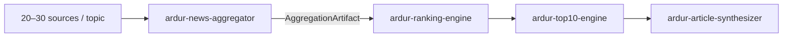

# ardur-news-aggregator

> **Stage 1 of the [Ardur AI content pipeline](./ARCHITECTURE.md).** Global
> multi-source ingestion, dedup, clustering, and aggregate interaction-metric
> capture. Produces an `AggregationArtifact` consumed by
> [`ardur-ranking-engine`](https://github.com/ArdurAI/ardur-ranking-engine).

This repository is the implemented Stage 1 aggregation package. It exposes
`runAggregation()` for programmatic use and the `ardur-news-aggregator` runner
for artifact-oriented pipeline orchestration. See [`docs/spec.md`](./docs/spec.md)
for the full design and [`ARCHITECTURE.md`](./ARCHITECTURE.md) for how the four
engines wire together.

## What it does

For each topic, every 6-hour cycle:

1. **Ingest** ≥ 20–30 curated global sources (primary vendor/standards feeds,
   news + financial press, technical/security press, arXiv, and the Google News
   RSS meta-feed) over an **SSRF-safe** fetch path.
2. **Dedup** exact repeats while *keeping* the same story from different sources
   (corroboration is signal, not noise).
3. **Cluster** items that cover the same story using token-overlap similarity
   with an entity boost (threshold ≈ 0.82).
4. **Capture** aggregate-only interaction metrics (feed position, cross-source
   mentions, velocity) — **never** any PII.

## Pipeline position



## Output contract

`runAggregation()` returns an `AggregationArtifact` — a versioned envelope from
[`@ardurai/contracts`](https://github.com/ArdurAI/ardur-contracts) with, per
topic:

- `itemsByTopic` — normalized `AggregatedItem[]` (title, source, tier, canonical
  URL, metadata-derived `summaryHint`, interaction metrics, `clusterId`).
- `clustersByTopic` — `Cluster[]` with distinct-source/domain counts and tier
  histogram (the corroboration signal ranking uses).
- `coverageByTopic` — `SourceCoverage` (configured/queried/responded/distinct,
  `degraded` flag when below the diversity floor).

## Project layout

| Path | Role |
|------|------|
| `data/sources.json` | Curated tiered source catalog used by the package at runtime. |
| `src/contracts-v3.ts` | Rev-3 bridge types until every consumer is fully on `@ardurai/contracts`. |
| `src/index.ts` | `runAggregation()` entrypoint + wiring. |
| `src/sources.ts` | Curated tiered source + topic registry (≥ 20/topic). |
| `src/ingest.ts` | Per-source fetch + parse → `RawItem[]`. |
| `src/dedup.ts` | Fingerprinting + duplicate collapse. |
| `src/cluster.ts` | Same-story clustering. |
| `src/interaction.ts` | Aggregate interaction-metric capture + PII screening. |
| `src/source-safety.ts` | SSRF-safe fetch primitives. |
| `src/runners.ts` | Uniform pipeline runner; installed as `ardur-news-aggregator`. |
| `src/cli.ts` | Legacy cycle runner, emit JSON. |

## Grounding in the existing system

This engine **extracts and generalizes** working code on
[`ardur.ai`](https://github.com/ArdurAI/ardur.ai) `main`:

- `scripts/refresh-news.mjs` → `ingest.ts` (fetch/parse/score), `dedup.ts`
  (`uniqueByTitle` → fingerprinting).
- `scripts/news-sources.mjs` → `sources.ts` (the allow-list/topics are the
  trusted **core**; expand each topic to ≥ 20–30).
- `scripts/source-safety.mjs` → `source-safety.ts` (port verbatim).
- `scripts/build-news-digests.mjs` clustering (`clusterItems`/`similarity`) →
  `cluster.ts`.

The existing single-meta-feed approach (Google News RSS only) is the **migration
starting point**; the standalone engine broadens to direct publisher feeds to
hit the 20–30-source diversity target. See `docs/spec.md` §"Migration".

## Getting started

```bash
npm install
npm run typecheck
npm test          # contract + wiring smoke tests
npm run build
npm run test:package
```

Installed consumers can use either the package API:

```js
import { runAggregation } from '@ardurai/news-aggregator';
```

or the runner boundary:

```bash
npx ardur-news-aggregator --describe
npx ardur-news-aggregator --out aggregation.json --provider deterministic
```

Configuration is environment-driven; copy `.env.example` to `.env`. The default
path is deterministic and zero-cost — no AI calls happen in this engine
(synthesis is stage 4).

## Guarantees

- **Copyright-safe** — captures metadata/feed hints and canonical links only;
  never the article body.
- **Privacy** — no PII in URLs or logs; metric keys screened against
  `FORBIDDEN_METRIC_KEY_FRAGMENTS`.
- **Source-safe** — HTTPS-only, allow-listed hosts, blocked private IPs, bounded
  reads.
- **Degrades, never aborts** — a failing source becomes a `warning` + degraded
  coverage, not a failed cycle.

## License

MIT © 2026 ArdurAI
