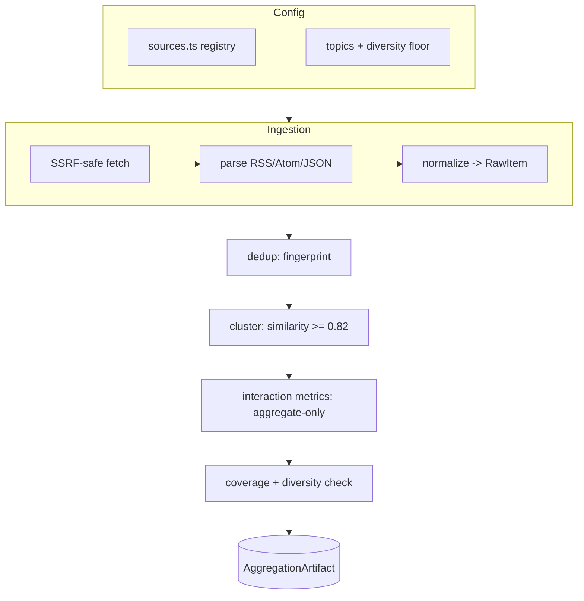
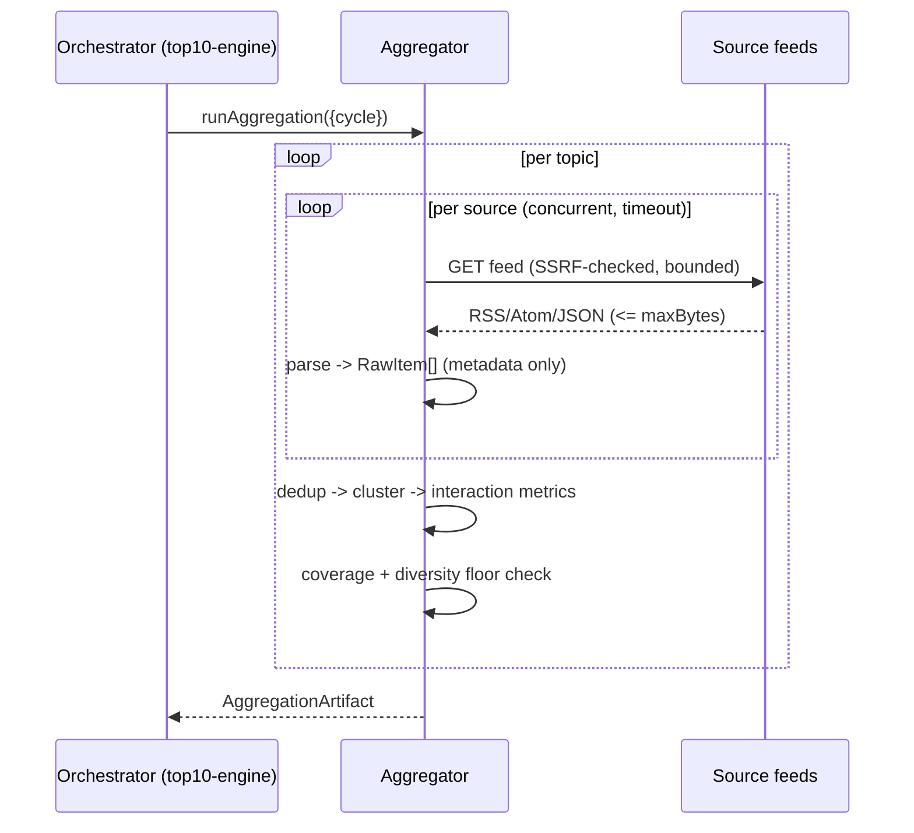

# ardur-news-aggregator — Design Specification

Schema version: `ardur-content-pipeline/v1` · Stage 1 of 4 · Status: **implemented** (2026-06-11)

---

## 1. Architecture overview

The aggregator is a **stateless batch function**: given a 6-hour cycle window, it
fetches every curated source for every topic, normalizes and dedups the items,
clusters same-story items across sources, projects aggregate interaction signals
onto each item, and emits a single `AggregationArtifact`. It holds no database;
its only output is the JSON artifact handed to the ranking engine. Previous-cycle
state is not required (clustering and metrics are computed within the window).

### Module boundaries

| Module | Input | Output | Extracted from |
|--------|-------|--------|----------------|
| `sources.ts` | — | `SourceDefinition[]`, `TopicDefinition[]` | `news-sources.mjs` |
| `ingest.ts` | source + topic | `RawItem[]` | `refresh-news.mjs` `fetchTopic` |
| `dedup.ts` | `RawItem[]` | deduped + fingerprints | `refresh-news.mjs` `uniqueByTitle` |
| `cluster.ts` | `AggregatedItem[]` | `Cluster[]` | `build-news-digests.mjs` `clusterItems` |
| `interaction.ts` | item + engagement | `InteractionMetrics` | new (privacy policy from `refresh-article-intelligence.mjs`) |
| `source-safety.ts` | URL/response | safe URL/text | `source-safety.mjs` (verbatim) |

## 2. Data flow

## 3. Data schemas + metadata fields

Authoritative types live in [`../src/contracts.ts`](../src/contracts.ts).

### `AggregatedItem`
| Field | Type | Notes |
|-------|------|-------|
| `id` | string | `${topic}-${hash(title+publishedAt)}` |
| `topic` / `topicLabel` | string | topic id + display label |
| `title` | string | cleaned headline, markup stripped |
| `source` / `sourceDomain` | string | display name / canonical host |
| `sourceUrl` / `url` | string | normalized public https; `url` carries no fragment, no PII |
| `tier` | `SourceTier` | `primary \| paper \| news \| technical-news \| security-news` |
| `publishedAt` | ISO 8601 UTC | parsed from feed, clamped to `now` if invalid |
| `summaryHint` | string | **feed/metadata-derived hint, ≤ ~32 words — never the article body** |
| `interaction` | `InteractionMetrics` | aggregate-only |
| `clusterId` | string | assigned by clustering |
| `fingerprint` | string | dedup key |

### `InteractionMetrics` (aggregate-only)
`feedRank`, `shares?`, `comments?`, `reactions?`, `crossSourceMentions`,
`velocity?`, `capturedAt`, `provenance`. Any key matching
`FORBIDDEN_METRIC_KEY_FRAGMENTS` is dropped at capture time.

### `Cluster`
`clusterId`, `headline`, `memberIds`, `sourceCount`, `distinctDomains`,
`tierHistogram`, `earliestPublishedAt`, `latestPublishedAt`.

### `SourceCoverage`
`sourcesConfigured`, `sourcesQueried`, `sourcesResponded`, `distinctDomains`,
`degraded` (true when `distinctDomains < topic.diversityFloor`).

## 4. Source ingestion strategy + source-diversity requirements

- **Target: ≥ 20–30 distinct sources per topic**, drawn from five tiers so no
  single outlet or viewpoint dominates a cluster.
- **Fetch strategies** (`FetchStrategy`): `rss` (direct publisher feed),
  `google-news-rss` (topic-query meta-feed, the existing default), `json`
  (structured APIs such as arXiv). New sources are added by declaring a strategy
  in `sources.ts` — no ingestion code change.
- **Diversity floor**: each topic declares a `diversityFloor` (default 20). If a
  cycle responds with fewer distinct domains, the topic is flagged `degraded` and
  a warning is emitted; the cycle still proceeds.
- **Concurrency + timeouts**: sources fetched concurrently with a per-source
  timeout; one slow/broken source cannot stall the cycle.
- **Allow-list only**: every host must be on the registry and pass
  `assertAllowedFetchUrl`. No arbitrary fetching.

## 5. Clustering + interaction-based weighting logic

- **Similarity**: token-overlap over title (markup-stripped, stopworded) with a
  1.5× boost for "important entity" tokens (e.g. `openai`, `kubernetes`,
  `nvidia`); merge threshold ≈ 0.82 (ported from `build-news-digests.mjs`).
- **Corroboration**: a cluster's `distinctDomains` and `tierHistogram` quantify
  how widely/credibly a story is reported — the primary cross-source signal the
  ranking engine consumes.
- **Interaction projection**: `crossSourceMentions` and `velocity` are
  cluster-level signals projected onto member items so downstream stages can read
  either granularity.

## 6. Error handling, monitoring, fallback

- **Per-source isolation**: `ingestSource` never throws; failures return
  `{ ok: false, error }` and surface as artifact `warnings` + degraded coverage.
- **Bounded reads**: responses capped (`rssMaxBytes` ≈ 1.5 MB) to bound memory
  and reject oversized payloads.
- **Idempotent per cycle**: re-running a `cycle.id` reproduces an equivalent
  artifact (modulo source-side changes).
- **Monitoring signals**: per-topic `sourcesResponded / sourcesConfigured`,
  `distinctDomains`, `degraded`, warning count, and total items. Emit these as
  structured logs (no PII) for the orchestrator's health checks.

## 7. Performance / scalability / latency targets

- **p95 ≤ 8 min** per full cycle (≈ 11 topics × ≥ 20 sources), fetched
  concurrently. Comfortably inside the 6-hour window.
- Horizontally shardable by topic if source counts grow (each topic is
  independent).
- Memory bounded by per-response byte cap × concurrency.

## 8. Security + data provenance

- **SSRF-safe**: HTTPS-only, allow-listed hosts, blocked private IPv4 ranges +
  all IPv6, blocked internal suffixes, port restriction (ported verbatim from
  `source-safety.mjs`).
- **No PII**: URLs normalized to strip credentials/fragments; interaction metrics
  aggregate-only; metric keys screened.
- **Provenance**: every item retains `source`, `sourceDomain`, `tier`, canonical
  `url`, and `publishedAt`; every metric retains a `provenance` string. This is
  what makes downstream copyright-safe attribution and audit possible.

## 9. Migration from `ardur.ai/main`

1. **Lift `source-safety.mjs`** into `src/source-safety.ts` unchanged (it is
   already engine-agnostic).
2. **Port `fetchTopic`/`scoreItem`/`splitTitle`** from `refresh-news.mjs` into
   `ingest.ts`. Drop the inline ranking score (that moves to the ranking engine);
   keep only normalization + `feedRank`.
3. **Promote `clusterItems`/`similarity`/`tokens`** from `build-news-digests.mjs`
   into `cluster.ts`, unchanged in behavior.
4. **Seed `sources.ts`** from `newsSourceAllowList` + `newsTopics`, then add
   direct publisher RSS feeds per topic until `diversityFloor` (≥ 20) is met.
5. The app keeps consuming the existing snapshot shape during migration; the
   `AggregationArtifact` is a superset, so a thin adapter bridges old → new.

## 10. Open questions (tracked as issues)

- Per-source credibility weights: static config vs learned.
- arXiv/JSON strategy normalization details.
- Velocity windowing across cycles (intra-window vs cross-cycle).
